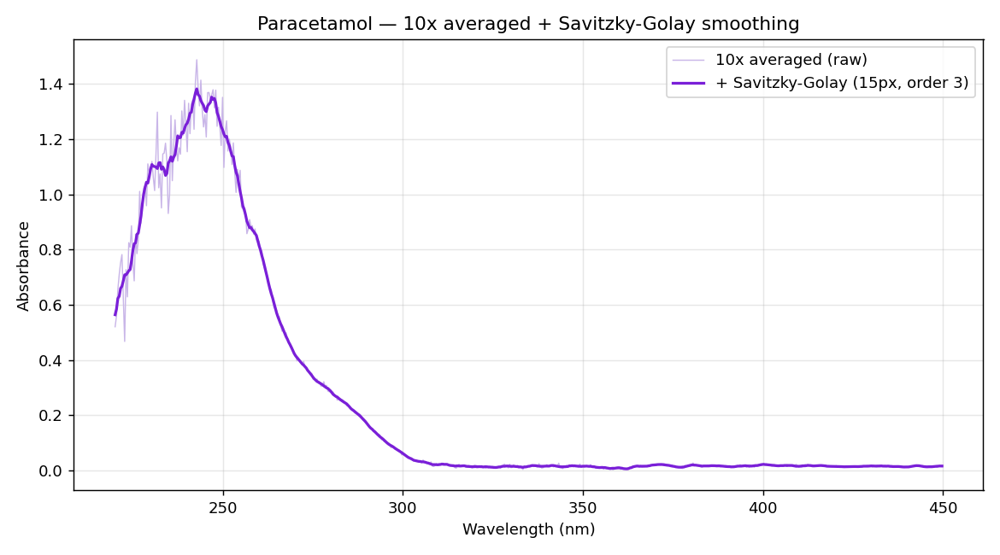
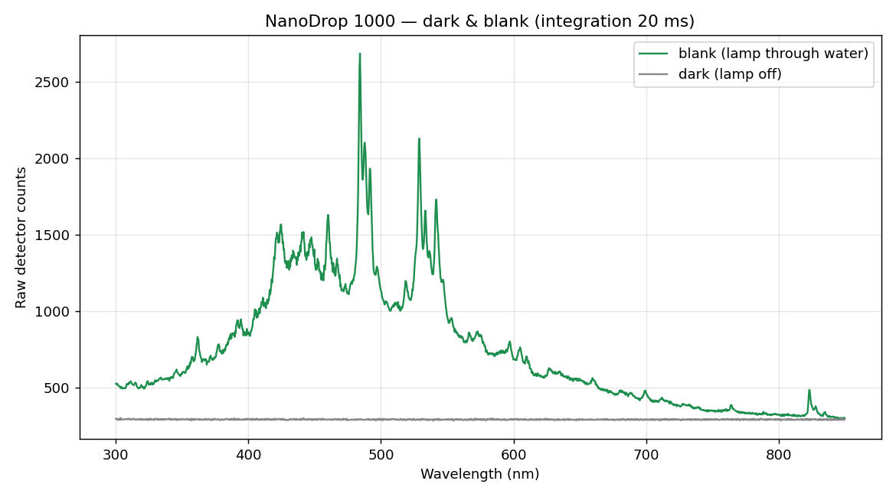
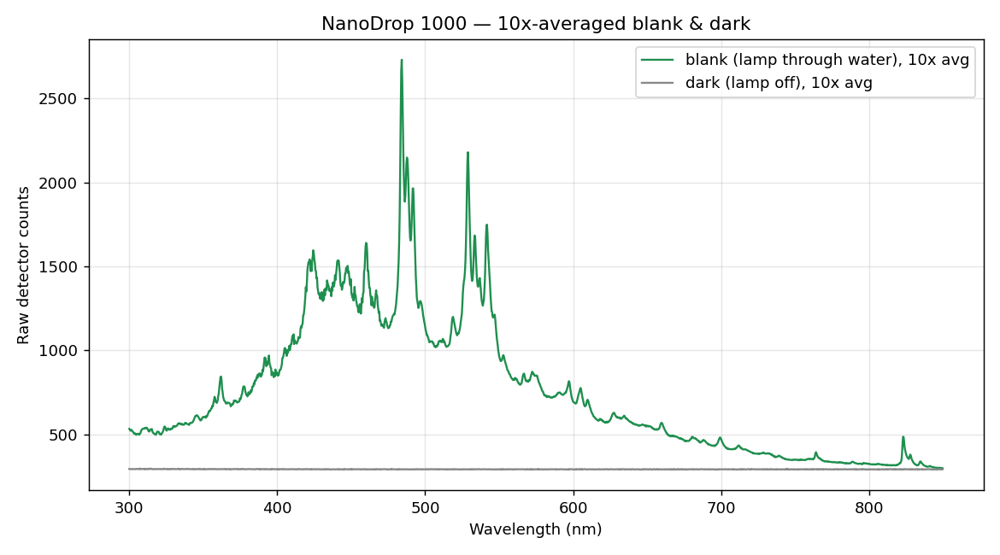
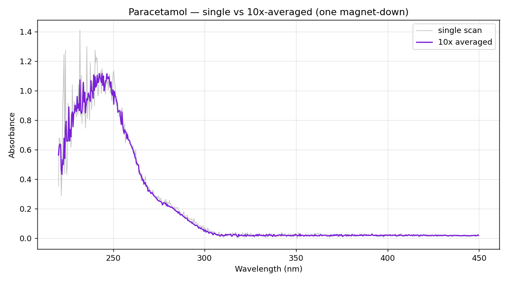
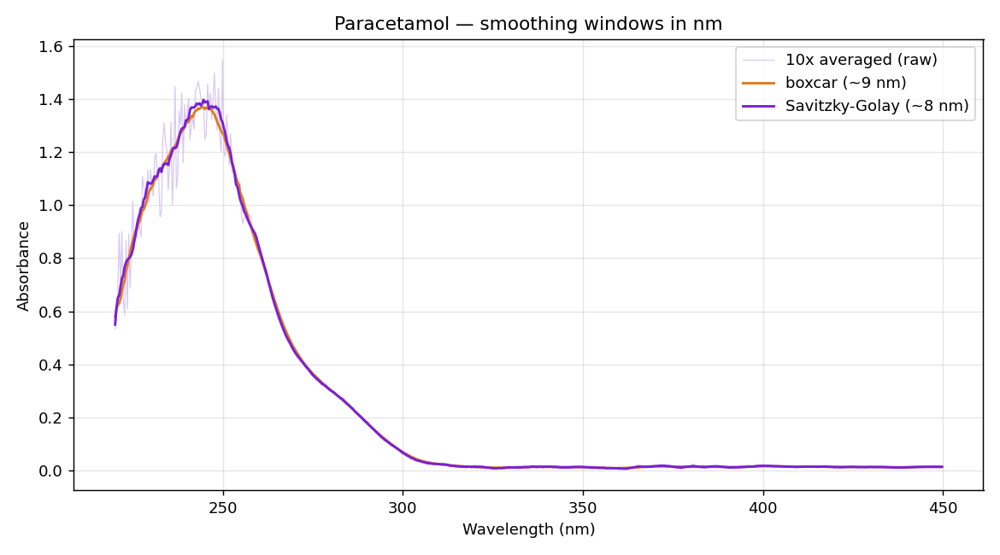

# NanoDrop 1000 via PyLabRobot — a working demo

Driving a legacy **Thermo Scientific NanoDrop ND-1000** spectrophotometer
entirely through **[PyLabRobot](https://github.com/PyLabRobot/pylabrobot)** on
macOS, and measuring a real **UV absorbance spectrum of paracetamol**
(acetaminophen / Tylenol).

This repo documents one measurement session end-to-end: raw detector counts →
averaged blank → absorbance → noise reduction by scan-averaging and curve
smoothing. Every plot below is real data measured on a physical instrument, not
a simulation.

   
  <em>Paracetamol, measured live through PyLabRobot: 10× averaged + Savitzky–Golay smoothing. λmax ≈ 243 nm.</em>

---

## Background

The NanoDrop ND-1000 has a reputation for being unusable on modern computers.
On the USB bus, though, it **is an Ocean Optics USB2000** spectrometer
(same vendor/product ID `2457:1002`, same endpoint map) running NanoDrop's own
firmware — so its protocol is largely the well-documented Ocean Optics "OOI"
protocol. Jordvl reverse-engineered the device and wrote the first open driver;
that work became [PyLabRobot PR #1166](https://github.com/PyLabRobot/pylabrobot/pull/1166),
which Rick Wierenga brought onto the current PyLabRobot architecture.

This demo is the **hardware validation** of that PR on macOS.

### The measurement pipeline

1. **`setup()`** — connect over USB, wake + initialise, and read the factory
   **wavelength-calibration coefficients** from the device (a cubic polynomial
   that maps each of the 2048 detector pixels to a wavelength in nm).
2. **Blank** — with plain water on the pedestal: acquire a **dark** frame
   (lamp off) and a **blank** frame (lamp on). The blank is "100 % transmission".
3. **Sample** — with paracetamol on the pedestal: acquire the sample frame.
4. **Absorbance** — Beer–Lambert:
   `A = −log10( (sample − dark) / (blank − dark) )`, per pixel.
5. **Averaging & smoothing** — reduce noise (see below).

Measured dispersion for this unit: **0.368 nm/pixel** (≈ 177–960 nm across the
array; useful range roughly 230–750 nm, limited by the xenon lamp).

---

## Results

### 1. Raw detector counts (single scan)

A single, unaveraged acquisition. The **green** trace is the blank — light from
the xenon lamp passing through transparent water — so it shows the **lamp's own
emission profile** (brightest in the blue-green, ~484 nm), *not* water's
spectrum. The **grey** trace is the dark frame (~292 counts), the detector's
baseline with the lamp off. Note how noisy a single scan is, especially where
counts are low.

### 2. 10×-averaged blank & dark

The same dark and blank, but **10 scans averaged** (within a single
pedestal-down / lamp-on cycle, the way the vendor software works). Random noise
falls as ≈ 1/√N, so the traces are visibly smoother. **This averaged blank is
the reference that every sample measurement is divided against.**

### 3. Absorbance — single scan vs 10× averaged

The paracetamol absorbance spectrum, **single scan (grey)** vs **10× averaged
(purple)**. The strong UV band (paracetamol's λmax ≈ 243 nm) is clearly
resolved; the visible region is flat because paracetamol is colourless.
Averaging cleans the mid-band and baseline substantially. The residual jitter at
the far-UV edge (< 235 nm) is a **hardware limit** — the lamp emits almost no
light there, so those pixels are photon-starved and no amount of averaging fully
rescues them.

### 4. Curve smoothing — boxcar vs Savitzky–Golay

Two smoothing filters applied to the 10×-averaged spectrum, windows expressed in
**nm** (the physically meaningful unit; the filter functions take a window in
detector pixels, here converted via 0.368 nm/pixel):

- **Boxcar (~9 nm)** — a simple moving average over adjacent pixels. This is the
  "boxcar width" control standard in Ocean Optics software.
- **Savitzky–Golay (~8 nm)** — a local polynomial fit that **preserves peak
  height and position** better than a boxcar.

For paracetamol's broad band both are safe; SG holds the peak a hair better.

---

## Data

Raw arrays from this session, so anyone can re-plot or re-analyse:

| file | contents |
|---|---|
| [`data/blank_10x_averaged.json`](data/blank_10x_averaged.json) | `dark[2048]`, `blank[2048]` (10×-averaged raw counts), `x_axis[2048]` (wavelengths, nm), `integration_ms` |
| [`data/paracetamol_10x_absorbance.json`](data/paracetamol_10x_absorbance.json) | `wl[2048]` (nm), `absb[2048]` (10×-averaged absorbance) |

---

## macOS fixes

Testing the PR on a real ND-1000 on macOS surfaced two issues, both fixed and
hardware-verified here:

- **`clear_halt` crash** — on macOS, libusb raises *"Entity not found"* for an
  endpoint that isn't actually halted, which crashed `setup()`. Made
  best-effort per endpoint (the reference Ocean Optics stack, `python-seabreeze`,
  doesn't call `clear_halt` at all).
- **Lamp not switching off** — the command-based lamp-off (`[0x03, 0x00]`) is
  unreliable on this device's firmware and intermittently left the lamp on. A
  **USB reset at teardown** (as Jord's original driver did) clears it reliably.

Both fixes: **[vcjdeboer/pylabrobot @ nanodrop-macos-fixes](https://github.com/vcjdeboer/pylabrobot/tree/nanodrop-macos-fixes)**

---

## References & credits

- **Jordvl — original reverse-engineering & driver:** [Pylabrobot-Open-science-ND1000](https://github.com/Jordvl/Pylabrobot-Open-science-ND1000)
- **PyLabRobot:** [PyLabRobot/pylabrobot](https://github.com/PyLabRobot/pylabrobot) · **PR #1166** [Add ND1000 backend support](https://github.com/PyLabRobot/pylabrobot/pull/1166) (Jordvl, refactored by Rick Wierenga)
- **python-seabreeze** — reference implementation of the Ocean Optics USB2000 protocol: [ap--/python-seabreeze](https://github.com/ap--/python-seabreeze)

An open-science project from Wageningen (Jord, Vittorio, Vincent). Analysis,
plots, and the macOS fixes in this repo were produced with Claude Code assisting
at the bench.
